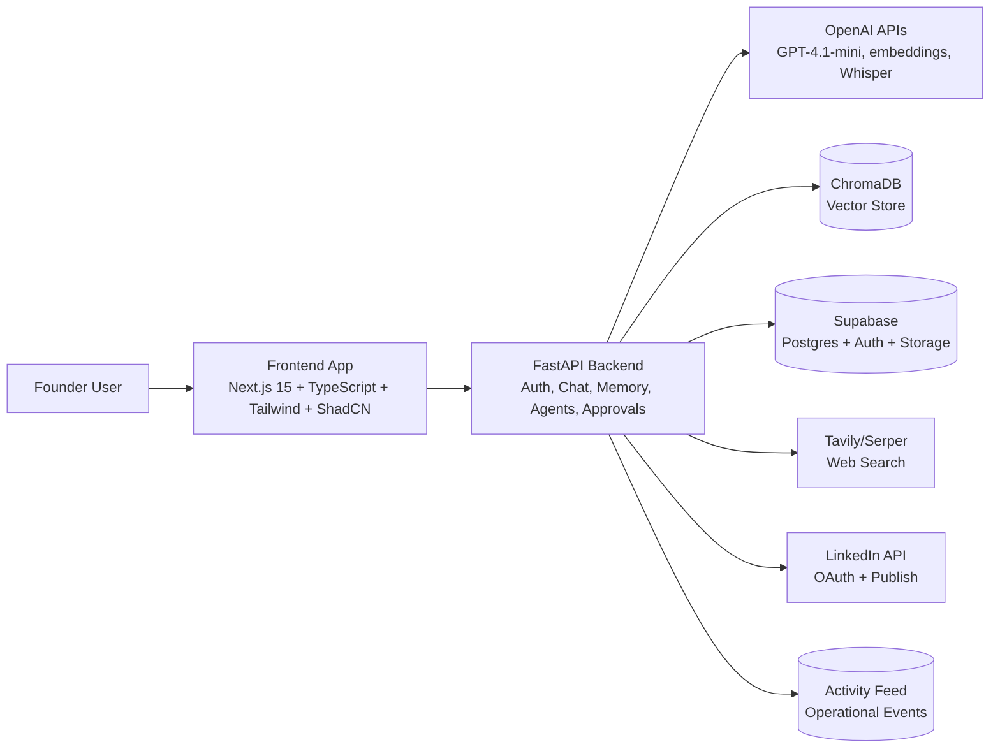

# FounderOS Initial System Architecture (MVP)

## 1) Scope and MVP Boundaries

This architecture is for the 2-day MVP in `docs/founderos_final_2_day_mvp_engineering_prd.md`.

Primary outcomes:
- memory-aware AI responses with company context
- specialized agent routing (research/content/executive)
- approval-first workflow before publishing
- LinkedIn publish flow
- operational activity feed

Explicit non-goals (MVP):
- no Redis/Celery/background worker infrastructure
- no Kubernetes
- no autonomous browser agents
- no multi-user collaboration/org model

## 2) UX and Frontend Consistency Rules

When implementing app UI after the landing page:
- keep the same visual language already defined in `frontend/src/index.css`
- reuse existing color tokens (`--rv-bg`, `--rv-bg-2`, `--rv-violet`, `--rv-cyan`, `--rv-text`)
- keep typography pattern (`Inter`, `Inter Tight`, `JetBrains Mono`) and hairline borders
- maintain the "premium operational" look and avoid generic chatbot styling
- preserve motion feel (subtle status animations, loaders, stream-like response behavior)

This keeps dashboard/workspace UI aligned with the existing landing page brand.

## 3) High-Level System Design



## 4) Runtime Components

### Frontend (Web)
- current codebase: `frontend/` (Next.js app carrying forward landing page UI system)
- MVP app areas: auth pages, protected workspace, memory panel, activity feed
- talks to backend through HTTPS JSON API
- streams responses for chat UX

### Backend (FastAPI + LangGraph)
- auth verification middleware (Supabase JWT)
- intent router for agent selection
- agent execution pipeline:
  1. route intent
  2. retrieve memory chunks
  3. optional web search
  4. generate output
  5. create approval item (if action-oriented)
  6. persist activity
- single-process API design for MVP speed

### Memory Layer
- upload PDF/TXT -> extract -> chunk -> embed -> store in ChromaDB
- retrieval by semantic similarity
- inject top relevant chunks into prompts

### Data Layer
- Supabase Postgres for relational entities (`documents`, `chats`, `generations`, `approvals`, `activities`)
- Supabase Storage for uploaded source files
- ChromaDB for vectors and fast semantic retrieval

## 5) Core Flows

### A) Company Brain Ingestion
1. user uploads PDF/TXT
2. backend extracts text
3. backend chunks text and creates embeddings
4. vectors stored in ChromaDB
5. metadata stored in Supabase
6. activity event written

### B) Chat/Agent Query
1. user prompt received
2. intent router chooses research/content/executive agent
3. memory retrieval from ChromaDB
4. optional web search via Tavily/Serper
5. LLM generates response (with cited context badges)
6. output returned with stream-like UX

### C) Approval + LinkedIn Publish
1. content agent drafts post
2. approval card created
3. user approves or rejects
4. on approve+publish, backend calls LinkedIn API
5. activity feed logs generation -> approval -> publish

## 6) Docker Topology (Local + CI)

Containers in `docker-compose.yml`:
- `frontend` -> Next.js app (`next start`, port 3000)
- `backend` -> FastAPI (`uvicorn`)
- `chroma` -> vector database

Supabase remains managed/external (not containerized in this repo).

## 7) Azure Deployment Topology

Target platform: Azure Container Apps (Docker-based, CI/CD friendly).

Deployed services:
- `founderos-frontend` container app (port 3000)
- `founderos-backend` container app

Managed dependencies:
- Supabase project (DB/Auth/Storage)
- OpenAI APIs
- Tavily/Serper
- LinkedIn app credentials

Optional cloud vector option later:
- keep Chroma self-hosted first
- migrate to managed pgvector when needed

## 8) GitHub CI/CD Workflow

Workflow file: `.github/workflows/deploy.yml`

Pipeline stages:
1. build frontend and backend Docker images
2. push images to Azure Container Registry (ACR)
3. deploy/update Azure Container Apps with new image tags

Triggers:
- push to `main`
- manual `workflow_dispatch`

## 9) Required Environment Variables

Application/runtime:
- `OPENAI_API_KEY`
- `SUPABASE_URL`
- `SUPABASE_ANON_KEY`
- `SUPABASE_SERVICE_ROLE_KEY`
- `TAVILY_API_KEY` (or `SERPER_API_KEY`)
- `LINKEDIN_CLIENT_ID`
- `LINKEDIN_CLIENT_SECRET`
- `LINKEDIN_REDIRECT_URI`

CI/CD secrets/variables:
- `AZURE_CREDENTIALS` (GitHub secret)
- `ACR_LOGIN_SERVER` (GitHub secret)
- `ACR_USERNAME` (GitHub secret)
- `ACR_PASSWORD` (GitHub secret)
- `AZURE_RESOURCE_GROUP` (GitHub variable)
- `AZURE_CONTAINERAPPS_ENVIRONMENT` (GitHub variable)
- `AZURE_LOCATION` (GitHub variable)
- `FRONTEND_APP_NAME` (GitHub variable)
- `BACKEND_APP_NAME` (GitHub variable)
- `NEXT_PUBLIC_API_BASE_URL` (GitHub variable)

## 10) Initial Repository Layout (Recommended)

```text
.
|- frontend/                 # Next.js app with landing + workspace UI
|  |- Dockerfile
|  |- src/app/
|  |- src/
|- backend/
|  |- app/main.py
|  |- requirements.txt
|  |- Dockerfile
|- docker-compose.yml
|- .github/workflows/deploy.yml
|- docs/founderos_initial_system_architecture.md
```

This gives a deployable baseline and a clear path to implement the remaining MVP features feature-by-feature.
